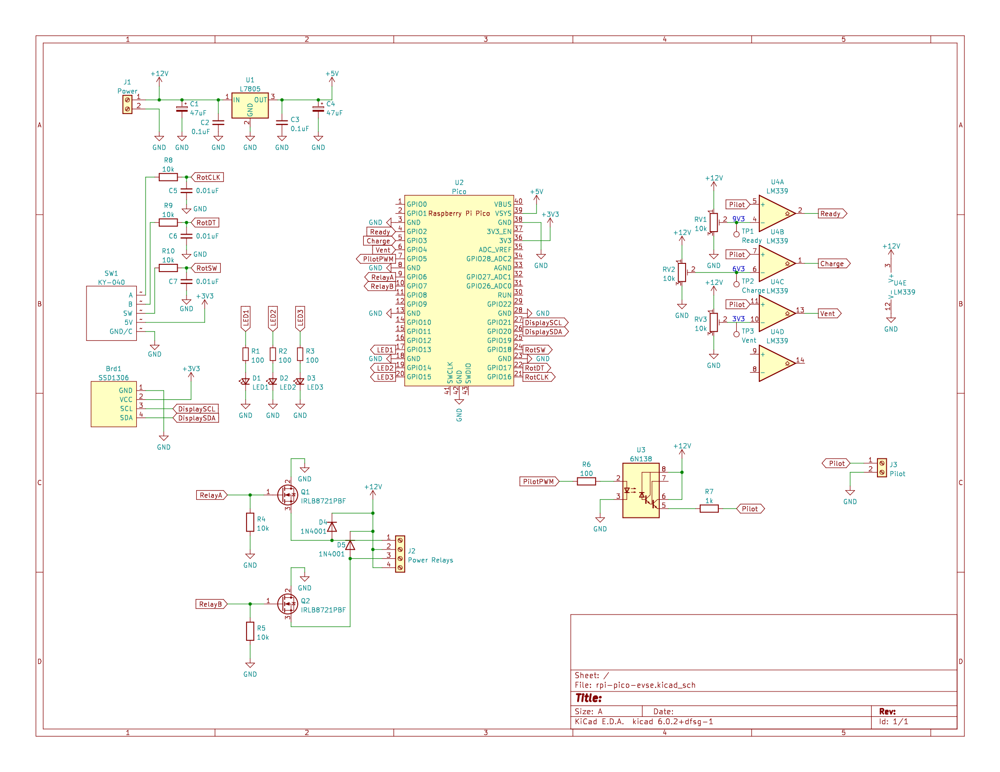

# Raspberry Pi Pico EVSE
Simple J1772 EVSE (Electric Vehicle Service Equipment) using the Raspberry Pi Pico. Based on information provided by [Jacob Dykstra](https://www.youtube.com/watch?v=wQfEOS1CL7I).

This project has not yet been thoroughly tested. Please be cautious when using especially around high voltage electricity.

## Compiling Firmware

* Configuring: `cmake -B build -S .`
* Compiling/Building: `make -C build`
* Writing: Hold BOOTSEL button on Pico, plug it in via USB, and release BOOTSEL. Copy and paste `rpi-pico-evse.uf2` into RPI-RP2 drive.
